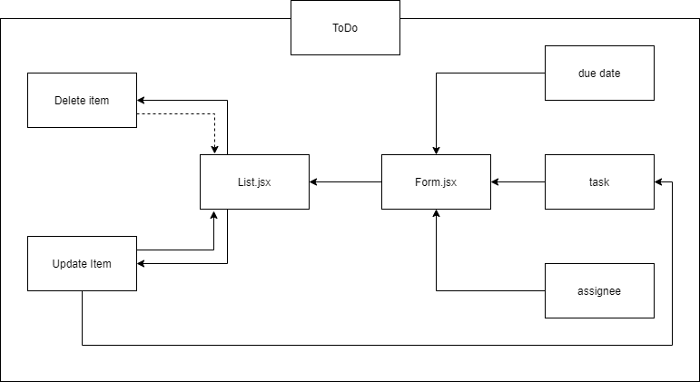
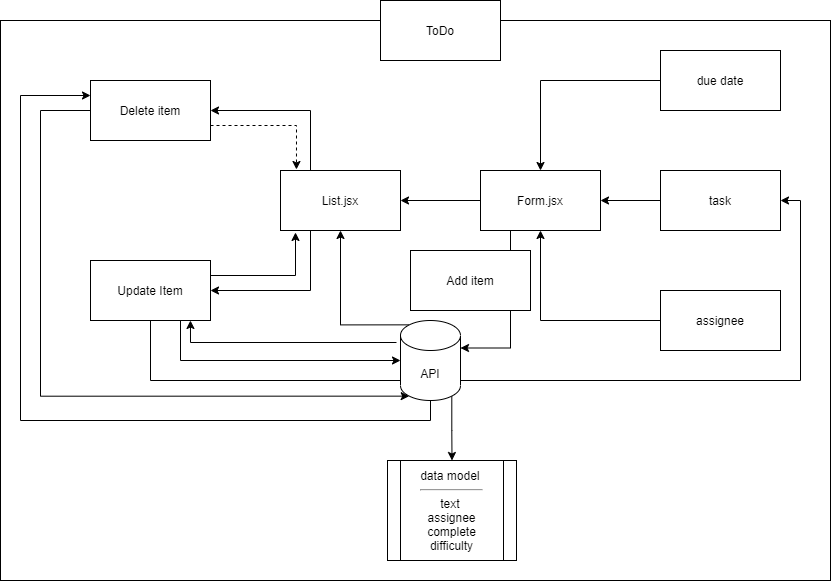

# todo

### Author: Tamara Al-billeh
* [submission PR](https://github.com/tamaraalbilleh/todo/pulls) .

### Running the app
- `npm start`

## Hooks API(phase 1)
### Deployment

* [deployment for main branch ](https://tama-todo.netlify.app/) .

### UML

(Created with [diagrams](https://app.diagrams.net/))

[for more clear view](https://app.diagrams.net/#G1t0IMLTseR6n0Ur3PcBmy_3T3_MBOf3T9) 

## Custom Hooks(phase 2)
### Deployment

* [deployment for main branch ](https://tama-todo.netlify.app/) .

### UML

(Created with [diagrams](https://app.diagrams.net/))

[for more clear view](https://app.diagrams.net/#G1t0IMLTseR6n0Ur3PcBmy_3T3_MBOf3T9) 
